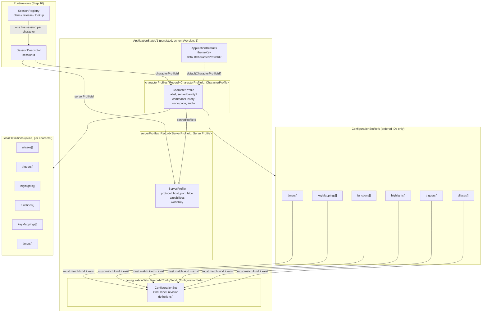
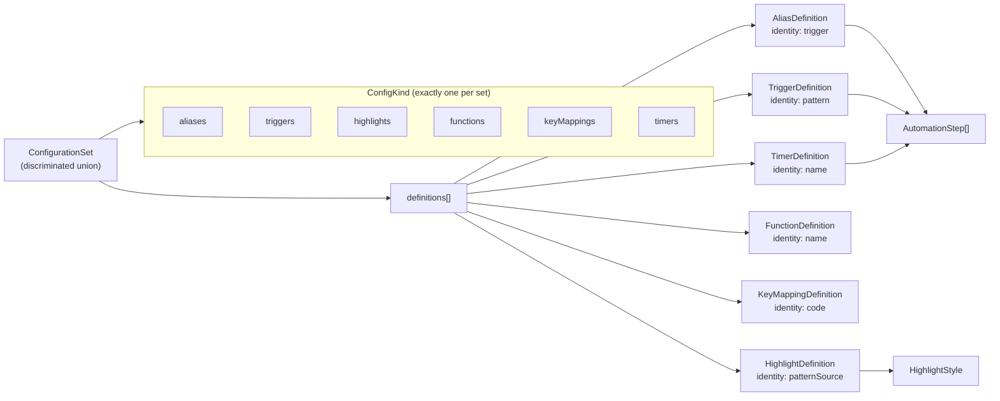
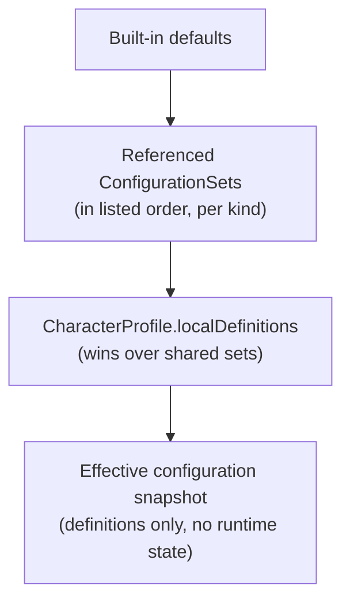

# Session and configuration domain model

Phase 1 contract for persisted profiles, shared configuration sets, and the
runtime session boundary. The TypeScript source of truth lives in
[`client/model/`](../client/model/).

This document describes the graph introduced in Phase 1 Step 3. It does not
cover persistence (`darkflow-session-core-v1`), effective-configuration
resolution, or live session runtime — those arrive in later steps.

## Persisted graph

`ApplicationStateV1` is the versioned JSON graph stored by the client. It
separates application defaults, server profiles, character profiles, and
shared configuration sets into keyed collections. Map keys must equal each
record's branded `id`.

Runtime sessions are **not** persisted. `SessionDescriptor` and
`SessionRegistry` are interface contracts for Step 10.

### Ownership rules

- Multiple character profiles may reference the same server profile and the
  same shared configuration sets.
- A character profile may have at most one live runtime session.
- `worldKey` on `ServerProfile` is an opaque server-owned value. It is not
  derived from host/port.
- Shared sets and local definitions contain **definitions only**. Runtime
  state — sockets, GMCP variables, timer handles, cooldowns, match state —
  stays on the session side of the boundary.

## Configuration sets and definitions

Each `ConfigurationSet` contains exactly one of six kinds. A character profile
holds ordered references per kind plus optional profile-local entries of the
same shape.

Manager-specific identity fields preserved from the legacy managers:

| Kind        | Identity field  |
| ----------- | --------------- |
| aliases     | `trigger`       |
| triggers    | `pattern`       |
| highlights  | `patternSource` |
| functions   | `name`          |
| keyMappings | `code`          |
| timers      | `name`          |

## Effective configuration resolution

Step 5 implements precedence and provenance. The contract already separates
shared references from local overrides so resolution can follow this order:

Later definitions replace earlier ones with the same manager-specific identity
within a kind.

## Source modules

| Module                                                                    | Role                                                |
| ------------------------------------------------------------------------- | --------------------------------------------------- |
| [`client/model/ids.ts`](../client/model/ids.ts)                           | Branded scoped UUIDs and test factories             |
| [`client/model/configuration.ts`](../client/model/configuration.ts)       | Six kinds, definition unions, set references        |
| [`client/model/profiles.ts`](../client/model/profiles.ts)                 | `ApplicationStateV1`, server and character profiles |
| [`client/model/session-contract.ts`](../client/model/session-contract.ts) | `SessionDescriptor`, `SessionRegistry`              |
| [`client/model/validators.ts`](../client/model/validators.ts)             | Typia structural validation and graph checks        |

## Related docs

- [Multi-connection UI proposal](plans/multi-connection-ui-proposal.md) —
  product rationale and ownership table
- [Phase 1 overview](plans/phase-1/multi-connection-ui-phase-1-implementation-plan.md) —
  step sequence including persistence and effective configuration
- [Phase 1 Step 3 implementation plan](plans/phase-1/multi-connection-ui-phase-1-step-3-implementation-plan.md) —
  contract decisions and validation requirements
